# AWS architecture

How this pipeline runs in AWS: GitHub Actions builds and deploys it,
Step Functions orchestrates it, Fargate runs it, S3 stores its data.
Nothing here changes the pipeline's own Python logic (ingestion,
normalization, transformation) — this layer only decides *when* and
*where* `main.py` runs, and *how results move between stages*.

## Components and why each exists

| Component | Role | Why this, not an alternative |
|---|---|---|
| GitHub OIDC | Temporary AWS credentials for GitHub Actions | No long-lived AWS Access Keys stored anywhere |
| Terraform | Infrastructure as Code | Reproducible, reviewable infra changes |
| Amazon ECR | Docker image registry | Standard pairing with ECS/Fargate |
| Amazon ECS on Fargate | Runs the pipeline container | Batch job (`RunTask` — start, run, exit), not a persistent service; no servers to patch |
| AWS Step Functions (Standard) | Orchestrates stage order, retries, parallelism | Native `ecs:RunTask.sync` integration — no polling code needed |
| Amazon EventBridge Scheduler | Fires the monthly update | Purpose-built recurring trigger, decoupled from GitHub |
| Amazon S3 | Data storage (raw/normalized/transformed) + run manifests + bootstrap marker | Already the pipeline's storage abstraction (`common/storage.py`) — cloud mode is additive, not new |
| CloudWatch Logs | Container + Step Functions execution logs | Centralized, queryable observability |
| AWS Budgets | Monthly cost tracking + email alerts | Notification-only cost visibility, scoped to this project's `Project` tag — never disables resources (see `budget.tf`, `docs/aws/operations.md`) |
| AWS Glue Data Catalog | Table definitions over the Gold Layer's Parquet files | Lets Athena query S3 Parquet as SQL tables without moving the data anywhere |
| Amazon Athena | SQL query engine for Metabase's dashboard queries | Serverless, pay-per-query — no cluster to run for what is a small, infrequently-queried Gold Layer |
| Metabase (EC2 + Docker) | Dashboard / BI tool | The one persistent, publicly-reachable resource this project runs — see `docs/aws/analytics.md` for its own network/security model |

**Analytics is a separate concern from ingestion.** Glue/Athena/Metabase
(`glue.tf`, `athena.tf`, `metabase.tf`) only ever *read* the Gold Layer
Parquet files the pipeline above already produces — nothing in this
layer writes back into `data/`, and none of it participates in the
Step Functions dependency graph below. See `docs/aws/analytics.md` for
that stack specifically.

**No Lambda in the execution path.** pandas/PyArrow/Shapely workloads
never run in Lambda (memory/time/package-size limits, and it would
duplicate Fargate's job for no benefit) — every stage runs as a
Fargate task. Step Functions' own intrinsic functions and native
service integrations (`ecs:RunTask.sync`) handle everything else
(retries, run-ID generation, per-source membership checks).

## Dependency graph

Reference/lookup data is prepared once (or rarely) by a separate
bootstrap pipeline; the main sources depend on it but never re-fetch it
themselves.

```mermaid
flowchart TB
    subgraph Bootstrap["Bootstrap (manual, rare)"]
        direction TB
        NUTS["EEA NUTS boundaries<br/>ingestion"]
        TC_ING["TED codelists<br/>ingestion"]
        TC_NORM["TED codelists<br/>normalization"]
        ST_ING["EEA stations<br/>ingestion"]
        ST_NORM["EEA stations<br/>normalization"]
        ST_TRANS["EEA stations<br/>transformation"]
        MANIFEST["Bootstrap completion manifest<br/>system/bootstrap/reference/latest.json"]

        TC_ING --> TC_NORM
        ST_ING --> ST_NORM --> ST_TRANS
        NUTS -.enriches.-> ST_TRANS
        NUTS --> MANIFEST
        TC_NORM --> MANIFEST
        ST_TRANS --> MANIFEST
    end

    subgraph Main["Historical / Update (checks bootstrap first)"]
        direction TB
        EEA_ING["EEA measurements<br/>ingestion"] --> EEA_NORM["EEA measurements<br/>normalization"] --> EEA_TRANS["EEA measurements<br/>transformation"]
        TED_ING["TED notices<br/>ingestion"] --> TED_NORM["TED notices<br/>normalization"] --> TED_TRANS["TED notices<br/>transformation"]
        EU_ING["Eurostat agri accounts<br/>ingestion"] --> EU_NORM["Eurostat agri accounts<br/>normalization"]
    end

    subgraph Gold["Gold (inside each branch, conditional)"]
        direction TB
        EEA_CHECK{"changed this run?"}
        TED_CHECK{"changed this run?"}
        EU_CHECK{"changed this run?"}
        EEA_GOLD["EEA measurements<br/>gold"]
        TED_GOLD["TED notices<br/>gold"]
        EU_GOLD["Eurostat agri accounts<br/>gold"]
    end

    MANIFEST -.gates.-> Main
    ST_TRANS -.stations for join.-> EEA_TRANS
    TC_NORM -.codelist labels, soft dep.-> TED_TRANS
    EEA_TRANS --> EEA_CHECK -->|yes| EEA_GOLD
    TED_TRANS --> TED_CHECK -->|yes| TED_GOLD
    EU_NORM --> EU_CHECK -->|yes| EU_GOLD
```



Key points this reflects from the actual code (see
`docs/pipelines/*.md` for source-level detail):

- **EEA stations' NUTS dependency is soft** (`transformation/eea/stations.py`):
  missing boundaries log a warning and leave NUTS fields empty rather
  than failing. **EEA measurements' stations dependency is hard**
  (`transformation/eea/measurements.py`): a missing transformed stations
  file raises `FileNotFoundError`. The bootstrap-completion gate exists
  precisely so historical/update never discover this the hard way, mid-run.
- **TED notices' codelist-label dependency is soft**
  (`transformation/ted/notices.py`): a missing codelist logs a warning
  and leaves that field's `_label` column empty.
- **Eurostat has no transformation stage** — it doesn't exist in the
  Python codebase, so nothing was invented for it here.
- Historical/update **never** touch NUTS boundaries, TED codelists, or
  EEA stations — those are bootstrap-only, on purpose (they change
  rarely; re-fetching them on every run would be wasteful and race
  against transformation runs already in flight).
- **Gold Layer** (`gold/<source>/*.py`, `docs/pipelines/gold_layer.md`)
  reads each source's already-normalized/transformed output and
  combines every country/year into one Parquet file with a fixed,
  renamed column set. Each of historical/update's three branches runs
  its own source's Gold build automatically right after its last data
  stage (transformation for EEA/TED, normalization for Eurostat) —
  **but only if that stage actually wrote something new this run**
  (`main.py check-manifest-has-output` gates it); if nothing changed,
  Gold is skipped and the branch still reports SUCCEEDED. A separate
  `GoldStandardStateMachine` also exists for a manual, on-demand full
  rebuild of all three sources regardless of whether anything changed
  recently — useful after fixing a Gold-layer bug, without re-running
  historical/update just to get there.

## Inter-stage data flow — manifests, not dataset content

Step Functions state transitions never carry dataset content — only
small metadata (`run_id`, source, stage, mode, countries, period, S3
manifest URI, counts, status). Every `main.py stage` invocation writes
its own manifest to
`s3://<bucket>/runs/<run_id>/<source>/<stage>.json`, built around
`common.manifest.StageResult` (the AWS-neutral return contract every
`run()` in this project returns) plus orchestration metadata the CLI
adds:

```json
{
  "run_id": "...", "source": "eea-measurements", "stage": "ingestion", "mode": "refresh",
  "countries": ["DE", "PL"], "period": null,
  "input_paths": [], "written_paths": ["data/raw/eea/measurements/DE/2026/PM10/..."],
  "changed_paths": ["..."], "unchanged_paths": [], "failed_paths": [],
  "started_at": "...", "finished_at": "...", "status": "SUCCEEDED"
}
```

The next stage reads that manifest via `--input-manifest` and
reprocesses only `written_paths` — normalization/transformation never
rescan a whole S3 prefix. An empty `written_paths` list is not an
error: the downstream stage completes as `SKIPPED` immediately (see
`main.py`'s `_execute_stage`), without ever calling into the
ingestion/normalization/transformation code with an empty input.

## Bootstrap completion manifest

`common/bootstrap.py` checks the *actual* presence of every required
reference output in S3 (not just whether the bootstrap run reported
success) and writes `system/bootstrap/reference/latest.json`.
Historical/update call `main.py check-bootstrap-complete` as their very
first Step Functions state — an incomplete or missing manifest fails
the execution immediately, before any main-data stage runs, so the
pipeline never silently continues with empty NUTS fields or codelist
labels.

## Network — why public subnets, no NAT Gateway

Fargate tasks are short-lived batch jobs that need outbound HTTPS to
the EEA/TED/Eurostat APIs and AWS service endpoints, and never accept
any inbound connection. A NAT Gateway would let tasks sit in private
subnets with no public IP, but costs ~$0.045/hour (~$32/month) plus
per-GB processing charges, running whether or not a task is active.
Public subnets with `assign_public_ip = true` and a security group
with **zero inbound rules** get the same outbound-only capability for
free — a task's ENI briefly holds a public IP for the few minutes it
runs, which is safe precisely because nothing is listening on it.
Revisit this trade-off if inbound connectivity (e.g. a long-running
service) is ever needed.

## IAM — deployment role vs. runtime roles

| Role | Assumed by | Purpose |
|---|---|---|
| `GitHubDeployRole` (pre-existing) | GitHub Actions, via OIDC | `terraform apply`, build/push images, `StartExecution` — **never runs the container** |
| `EcsTaskExecutionRole` | ECS agent | Pull the image from ECR, ship logs to CloudWatch |
| `PipelineTaskRole` | The container itself | Read/write the pipeline S3 bucket — nothing else |
| `StepFunctionsRole` | Every state machine | `ecs:RunTask`/`StopTask`/`DescribeTasks`, `iam:PassRole` (scoped to the two ECS roles above), Step Functions execution logging |
| `SchedulerRole` | EventBridge Scheduler | `states:StartExecution` on `UpdateStateMachine` only |

The container **never** runs under `GitHubDeployRole` — `PipelineTaskRole`
is deliberately narrower than the deployment role and has no IAM,
Step Functions, or EC2 permissions at all.

## Terraform state

A separate, versioned, encrypted S3 bucket
(`procurement-pipeline-tfstate-137307166874`), created idempotently by
`infrastructure/bootstrap/bootstrap-state-backend.sh` before the first
`terraform init`. Locking uses Terraform's native S3 locking
(`use_lockfile = true`, Terraform ≥1.10) — no DynamoDB table. State is
never kept only on an ephemeral GitHub Actions runner.
